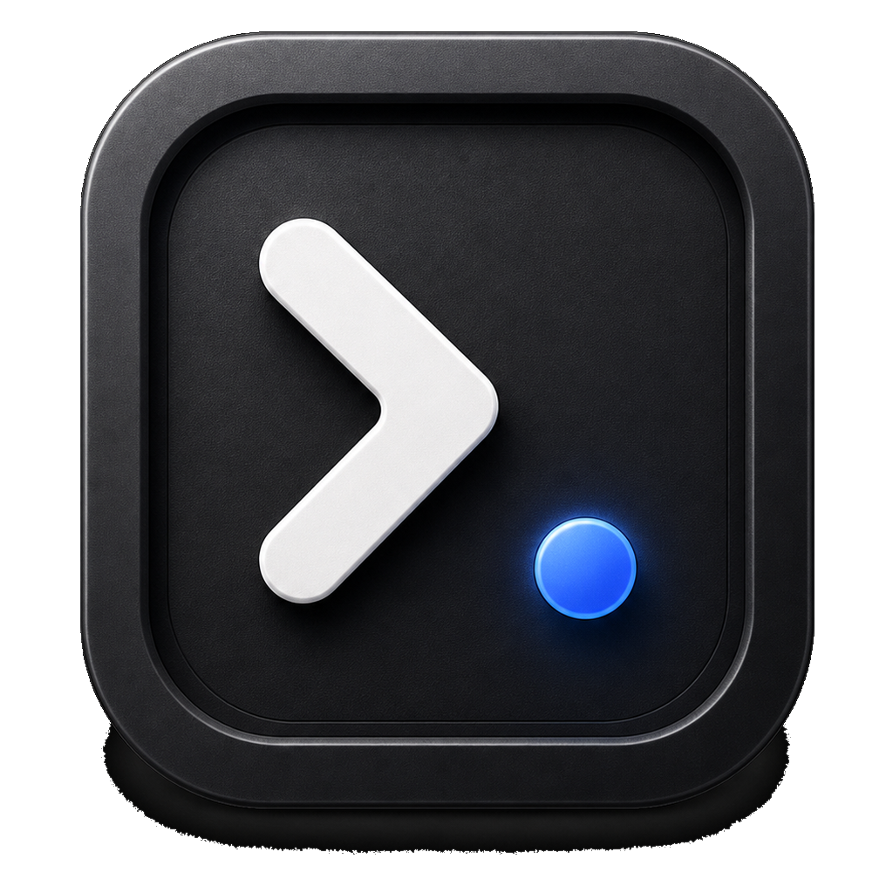

# Runline for Cursor

<p align="center">
  
</p>

Runline is a native iOS 26+ client for working with Cursor Cloud Agents from iPhone and iPad. It keeps the default path simple: connect a Cursor API key, choose a repository, start a Cloud Agent run, and continue the conversation from a system-native chat interface.

Runline also includes an optional Mac-side bridge for Cursor SDK sessions. The bridge is only needed when a user wants SDK-specific workflows such as MCP profiles, SDK session state, or local Mac-assisted pairing.

Runline is independent and is not affiliated with, endorsed by, or connected to Cursor or Anysphere.

[](LICENSE)
[](https://www.npmjs.com/package/runline-bridge)

## Project Status

Runline is in public beta.

- iOS app: native SwiftUI app for iOS 26+ and iPadOS 26+.
- Cloud Agent mode: default, fully on-device direct integration with Cursor's Cloud Agents API.
- Cursor SDK mode: optional, powered by `runline-bridge` on the user's Mac or a trusted HTTPS bridge.
- TestFlight/App Store Connect releases: maintainer-managed.
- npm package: `runline-bridge@0.1.5` is published on both `latest` and `beta`.

## What Runline Does

- Stores the user's Cursor API key in iOS Keychain.
- Lists Cursor repositories and models.
- Starts Cursor Cloud Agent runs from native iOS forms.
- Streams and restores run timelines with cleaner event grouping.
- Lets users continue terminal runs with a native chat composer.
- Supports images and files as prompt context where the Cursor API path accepts them.
- Shows artifacts, PR links, run status, archive/delete/cancel actions, and notification preferences.
- Adapts the same SwiftUI experience to iPhone and iPad, including portrait and landscape.
- Supports system appearance, light mode, dark mode, and user-selected appearance preferences.
- Provides an optional Cursor SDK bridge path for users who want SDK sessions from their Mac.

## Runtime Modes

| Mode | Where it runs | Best for | Requirements |
| --- | --- | --- | --- |
| Cloud Agent | Directly from iOS to Cursor Cloud Agents | Most users, TestFlight users, repository tasks, follow-ups, artifacts, PR workflows | Cursor API key |
| Cursor SDK | iOS app plus Runline Bridge | SDK sessions, MCP profiles, richer local tooling, Mac-assisted workflows | Cursor API key, Node.js 20+, `runline-bridge` |

Cloud Agent mode does not require Node, a Mac bridge, a hosted backend, or any Runline server.

Cursor SDK mode is intentionally opt-in. It should be treated as a power-user path until the bridge and pairing flow are hardened further.

For the public-source boundary between direct Cloud Agent usage, optional bridge usage, and private release/deployment configuration, see [SELF_HOSTING_MODEL.md](SELF_HOSTING_MODEL.md).

## Install the iOS Beta

The iOS beta is distributed through TestFlight by the maintainer. Once installed:

1. Open Runline.
2. Connect a Cursor API key.
3. Keep Cloud Agent as the default mode unless you specifically want the SDK bridge.
4. Select a repository and launch a chat.
5. Continue completed runs from the chat composer.

Cursor API keys stay on device in Keychain for direct Cloud Agent requests.

## Optional Cursor SDK Mode

Install the bridge only if you want Cursor SDK mode:

```bash
npm install -g runline-bridge
export CURSOR_API_KEY="replace-with-your-cursor-key"
runline-bridge up
```

The bridge prints a physical-device `iPhone URL` and a Runline setup QR/link. In Runline's Cursor SDK onboarding, tap **Scan with QR Code** to set the bridge URL automatically, then tap **Pair with Code** and enter the terminal code.

To keep your Mac awake while testing Cursor SDK mode:

```bash
runline-bridge up --keep-awake
```

Keep Awake is optional, macOS-only, and stops when the bridge exits. Cloud Agent mode does not need your Mac awake.

For Simulator development, `http://localhost:8787` is usually enough.

For a physical iPhone on the same Wi-Fi network:

```bash
ipconfig getifaddr en0
```

Then enter `http://<mac-lan-ip>:8787` in Runline Settings and pair with the one-time code printed by the bridge.

The bridge does not need to store Cursor API keys. It can accept a per-request bearer token from the iOS app, or use `CURSOR_API_KEY` from the user's local shell environment.

For LAN, Tailscale, temporary tunnel, and hosted HTTPS bridge setups, see [docs/self-hosting.md](docs/self-hosting.md).

## Repository Layout

```text
Runline/                  SwiftUI app source
RunlineTests/             Unit tests for app state, providers, cache, routing, and bridge mapping
orchestrator/             runline-bridge npm package
DesignAssets/             Public logo and app icon source previews
Legal/                    Trademark and branding guidance
Tools/                    Maintainer utilities such as build-number updates
.asc/                     Sanitized ASC workflow example only; live config is ignored
.github/                  CI, issue templates, PR template, Dependabot
docs/                     Release and maintainer documentation
AGENTS.md                 Operating rules for contributors and coding agents
SELF_HOSTING_MODEL.md     Public repo and self-hosting boundary
```

## Development Setup

Requirements:

- macOS
- Xcode 26 or newer with the iOS 26 simulator runtime
- Swift 6
- Node.js 20 or newer
- npm
- XcodeGen, if regenerating the Xcode project from `project.yml`

Install bridge dependencies:

```bash
npm --prefix orchestrator install
```

Run bridge checks:

```bash
npm --prefix orchestrator run typecheck
npm --prefix orchestrator run build
npm --prefix orchestrator audit --audit-level=high
```

Run iOS tests:

```bash
xcodebuild test \
  -project Runline.xcodeproj \
  -scheme Runline \
  -destination 'platform=iOS Simulator,name=iPhone 17,OS=26.4.1'
```

Run metadata checks:

```bash
xcodebuild -list -project Runline.xcodeproj
ruby -c Tools/set_build_number.rb
plutil -lint ExportOptions-AppStore.plist ExportOptions-TestFlightUpload.plist Runline/Resources/Info.plist Runline/Resources/PrivacyInfo.xcprivacy Runline/Resources/Runline.entitlements
```

Run secret scanning before public release work:

```bash
gitleaks detect --source . --redact --verbose
gitleaks detect --source . --no-git --redact --verbose
```

## Release Channels

| Channel | Current state | Notes |
| --- | --- | --- |
| GitHub | Public repository at `parrisdigital/runline` | Source, docs, issues, releases |
| npm | `runline-bridge@0.1.5` on `latest` and `beta` | Optional bridge for Cursor SDK mode |
| TestFlight | Runline `1.0 (17)` in internal and external beta testing | Requires App Store Connect access |

See [docs/RELEASES.md](docs/RELEASES.md) for the maintainer release checklist, [CHANGELOG.md](CHANGELOG.md) for public release notes, and [docs/ROADMAP.md](docs/ROADMAP.md) for the beta roadmap.

## Maintainer TestFlight Workflow

TestFlight and App Store releases are maintainer-only and are not required for contributors.

Local ASC automation expects a private `Runline` App Store Connect profile in the maintainer's keychain. Keep Apple API keys, signing files, live ASC workflow config, archives, IPAs, and ASC run artifacts out of git.

Use the sanitized example as the starting point for local release work:

```bash
cp .asc/workflow.example.json .asc/workflow.json
```

Then fill in the local App Store Connect app and TestFlight group IDs. The live `.asc/workflow.json` file is ignored by git.

Run local preflight checks:

```bash
asc workflow run preflight
```

Upload a TestFlight build with an explicit build number:

```bash
asc workflow run testflight BUILD_NUMBER:<next-build-number>
```

Use explicit build numbers so TestFlight stays aligned with the active Runline sequence.

## Security Model

- Cursor API keys are stored on iOS in Keychain.
- Bridge pairing tokens are stored on iOS in Keychain.
- Cloud Agent mode works without any Runline backend.
- Cursor SDK mode uses a user-controlled bridge.
- The bridge must not log or persist user Cursor API keys.
- Apple signing material, npm tokens, API keys, `.env` files, archives, IPAs, and provisioning profiles must never be committed.

Report vulnerabilities privately through [SECURITY.md](SECURITY.md).

## Contributing

See [CONTRIBUTING.md](CONTRIBUTING.md), [AGENTS.md](AGENTS.md), [SECURITY.md](SECURITY.md), [SUPPORT.md](SUPPORT.md), [CODE_OF_CONDUCT.md](CODE_OF_CONDUCT.md), and [Legal/TRADEMARKS.md](Legal/TRADEMARKS.md).

## License

Runline is released under the [MIT License](LICENSE).
